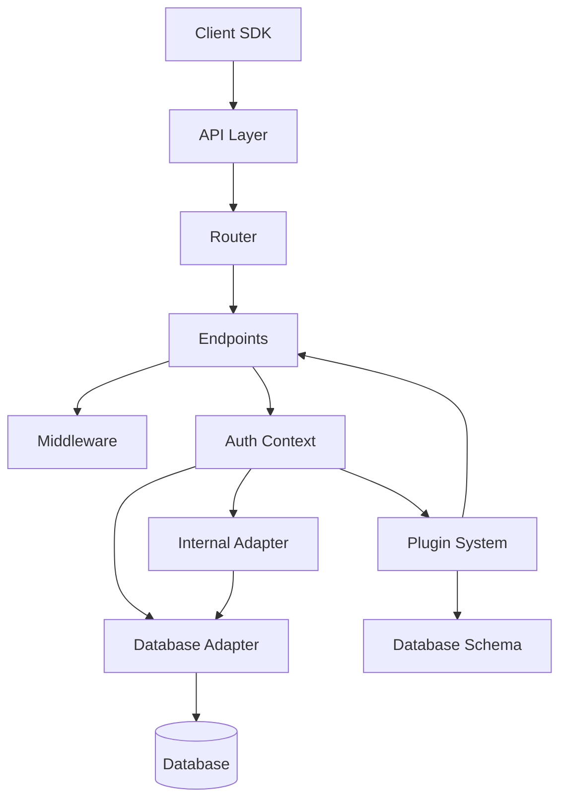
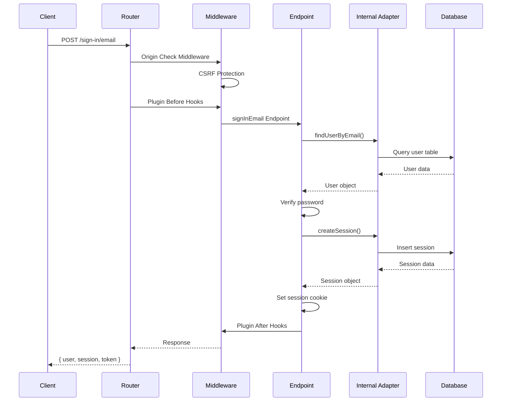

## Overview

Better Auth is built with a modular, extensible architecture that separates concerns and allows for flexible integration with different frameworks and databases. The architecture follows a layered approach with clear boundaries between components.



## Core Components

### 1. Better Auth Instance

The entry point for Better Auth is the `betterAuth` function, which initializes the authentication system with your configuration:

```typescript
import { betterAuth } from "better-auth"

const auth = betterAuth({
  database: /* your database connection */,
  plugins: [/* optional plugins */],
  // ... other options
})
```

The `betterAuth` function creates an `Auth` instance that provides:
- **Server API**: Methods to handle authentication on the server
- **Handler**: Request handler for your framework
- **Database migrations**: Automatic schema management

<Info>
For minimal mode (without Kysely), you can import from `better-auth/minimal` instead.
</Info>

### 2. Auth Context

The Auth Context is the central state container that holds all authentication-related configuration and utilities. It's available to all endpoints, middleware, and plugins.

Key context properties from `packages/core/src/types/context.ts:177`:

```typescript
interface AuthContext {
  options: BetterAuthOptions           // User configuration
  baseURL: string                       // Base URL for auth endpoints
  trustedOrigins: string[]              // Allowed origins for CORS
  adapter: DBAdapter                    // Database adapter
  internalAdapter: InternalAdapter      // High-level DB operations
  secret: string                        // Secret for signing/encryption
  sessionConfig: SessionConfig          // Session settings
  password: PasswordConfig              // Password hashing config
  socialProviders: OAuthProvider[]      // OAuth providers
  tables: BetterAuthDBSchema            // Database schema
  generateId: Function                  // ID generation
  logger: Logger                        // Logging utility
  // ... and more
}
```

### 3. API Layer

The API layer is built on top of [Better Call](https://github.com/jliocsar/better-call), a type-safe RPC framework. It handles:

- **Endpoint registration**: Core and plugin endpoints
- **Middleware execution**: Origin checks, rate limiting, etc.
- **Request/response handling**: JSON parsing, cookie management
- **Error handling**: Consistent error responses

From `packages/better-auth/src/api/index.ts:254`:

```typescript
const router = createRouter(api, {
  routerContext: ctx,
  basePath,
  routerMiddleware: [
    {
      path: "/**",
      middleware: originCheckMiddleware,
    },
    ...pluginMiddlewares,
  ],
  async onRequest(req) {
    // Handle disabled paths, plugin hooks, rate limiting
  },
  async onResponse(res) {
    // Plugin response hooks
  },
  onError(e) {
    // Error logging and handling
  },
})
```

### 4. Adapter System

The adapter system provides a unified interface for database operations, abstracting away database-specific implementations.

**Two-layer architecture:**

1. **Low-level Adapter** (`DBAdapter`): Database-agnostic CRUD operations
2. **Internal Adapter** (`InternalAdapter`): High-level authentication operations

From `packages/core/src/db/adapter/index.ts:385`:

```typescript
interface DBAdapter {
  create<T>(data: { model: string; data: T }): Promise<T>
  findOne<T>(data: { model: string; where: Where[] }): Promise<T | null>
  findMany<T>(data: { model: string; where?: Where[] }): Promise<T[]>
  update<T>(data: { model: string; where: Where[]; update: T }): Promise<T | null>
  delete(data: { model: string; where: Where[] }): Promise<void>
  count(data: { model: string; where?: Where[] }): Promise<number>
  transaction<R>(callback: (trx) => Promise<R>): Promise<R>
}
```

The Internal Adapter wraps the low-level adapter with authentication-specific logic:

```typescript
interface InternalAdapter {
  createUser(user: Partial<User>): Promise<User>
  createSession(userId: string, dontRememberMe?: boolean): Promise<Session>
  findUserByEmail(email: string): Promise<User | null>
  createOAuthUser(user, account): Promise<{ user: User; account: Account }>
  // ... and many more
}
```

<Tip>
The adapter system supports multiple databases out of the box: PostgreSQL, MySQL, SQLite, MongoDB, and more. You can also create custom adapters.
</Tip>

### 5. Plugin System

Better Auth's plugin system allows extending functionality without modifying core code. Plugins can:

- Add new endpoints and routes
- Extend database schema
- Add middleware and hooks
- Provide client-side methods

From `packages/core/src/types/plugin.ts:31`:

```typescript
interface BetterAuthPlugin {
  id: string
  init?: (ctx: AuthContext) => Awaitable<void>
  endpoints?: Record<string, Endpoint>
  middlewares?: { path: string; middleware: Middleware }[]
  hooks?: {
    before?: { matcher: Function; handler: Middleware }[]
    after?: { matcher: Function; handler: Middleware }[]
  }
  schema?: BetterAuthPluginDBSchema  // Extend database schema
  migrations?: Record<string, Migration>
  rateLimit?: RateLimitRule[]
  onRequest?: (request: Request, ctx: AuthContext) => Promise<any>
  onResponse?: (response: Response, ctx: AuthContext) => Promise<any>
}
```

### 6. Request Flow

Here's how a typical authentication request flows through the system:



## Design Principles

### Type Safety

Better Auth is built with TypeScript and provides full type inference throughout:

- Plugin configurations are fully typed
- Endpoint inputs/outputs are type-safe
- Database schema is validated at compile time
- Client SDK has complete type inference

### Framework Agnostic

Better Auth is designed to work with any JavaScript framework:

- Core is framework-independent
- Adapters handle framework-specific concerns
- Standard Web APIs (Request/Response) are used
- Easy integration with Next.js, SvelteKit, Solid Start, etc.

### Extensibility

Every aspect of Better Auth can be extended:

- **Plugins**: Add new authentication methods
- **Adapters**: Support new databases
- **Middleware**: Add custom request/response logic
- **Hooks**: Intercept authentication flows
- **Schema**: Extend database tables with custom fields

### Security First

- CSRF protection enabled by default
- Origin checking for all requests
- Secure session management with rotation
- Rate limiting built-in
- Password hashing with modern algorithms
- Encrypted cookies for sensitive data

### Performance

- Session caching in cookies to reduce DB queries
- Connection pooling for database operations
- Lazy loading of plugins and providers
- Optimized query patterns in adapters
- Background task support for non-blocking operations

## Configuration

The main configuration object accepts numerous options:

```typescript
interface BetterAuthOptions {
  database: Database | Adapter         // Required: database connection
  baseURL?: string                     // Base URL for callbacks
  secret?: string                      // Signing/encryption secret
  trustedOrigins?: string[]            // Allowed CORS origins
  plugins?: BetterAuthPlugin[]         // Extend functionality
  session?: SessionOptions             // Session configuration
  user?: UserOptions                   // User table customization
  emailAndPassword?: EmailPasswordOptions
  socialProviders?: SocialProviderConfig[]
  rateLimit?: RateLimitOptions
  advanced?: AdvancedOptions
  // ... and more
}
```

<Note>
See the [Configuration guide](/guides/configuration) for detailed options and examples.
</Note>

## Next Steps

<CardGroup cols={2}>
  <Card title="Authentication" icon="lock" href="/concepts/authentication">
    Learn about authentication methods and flows
  </Card>
  <Card title="Sessions" icon="clock" href="/concepts/sessions">
    Understand session management and storage
  </Card>
  <Card title="Database" icon="database" href="/concepts/database">
    Explore database adapters and schema
  </Card>
  <Card title="Plugins" icon="puzzle-piece" href="/concepts/plugins">
    Discover how to extend Better Auth
  </Card>
</CardGroup>