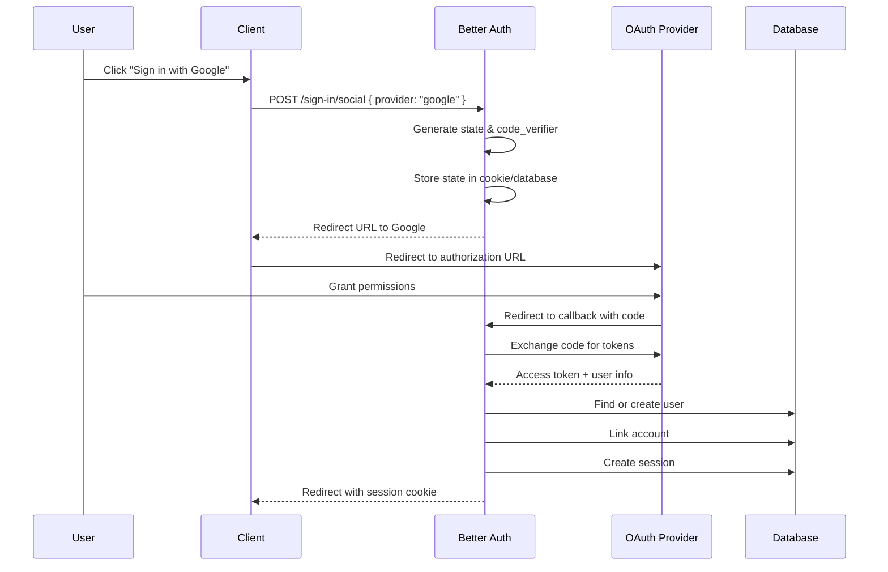

## Overview

Better Auth supports multiple authentication methods out of the box, each designed with security and user experience in mind. The authentication system is built around a flexible endpoint architecture that makes it easy to add new methods via plugins.

## Authentication Methods

### Email & Password

The most common authentication method, supporting sign-up, sign-in, and password management.

**Sign Up Flow** - From `packages/better-auth/src/api/routes/sign-up.ts`:

```typescript
// Client code
await authClient.signUp.email({
  email: "user@example.com",
  password: "secure-password",
  name: "John Doe",
  callbackURL: "/dashboard"
})

// Server endpoint
export const signUpEmail = createAuthEndpoint(
  "/sign-up/email",
  {
    method: "POST",
    body: z.object({
      email: z.string(),
      password: z.string(),
      name: z.string(),
      callbackURL: z.string().optional(),
    }),
  },
  async (ctx) => {
    // 1. Validate input
    const { email, password, name } = ctx.body
    
    // 2. Check if user exists
    const existingUser = await ctx.context.internalAdapter.findUserByEmail(email)
    if (existingUser) {
      throw new APIError("BAD_REQUEST", {
        message: "User already exists"
      })
    }
    
    // 3. Hash password
    const hashedPassword = await ctx.context.password.hash(password)
    
    // 4. Create user and credential account
    const user = await ctx.context.internalAdapter.createUser({
      email,
      name,
      emailVerified: false
    })
    
    await ctx.context.internalAdapter.createAccount({
      userId: user.id,
      providerId: "credential",
      accountId: user.email,
      password: hashedPassword
    })
    
    // 5. Create session
    const session = await ctx.context.internalAdapter.createSession(user.id)
    
    // 6. Set session cookie
    await setSessionCookie(ctx, { session, user })
    
    return ctx.json({ user, session })
  }
)
```

**Sign In Flow** - From `packages/better-auth/src/api/routes/sign-in.ts:438`:

```typescript
await authClient.signIn.email({
  email: "user@example.com",
  password: "secure-password",
  rememberMe: true  // Default: true
})
```

The sign-in process:

1. **Validate email format**
2. **Find user by email** with associated accounts
3. **Verify password** against stored hash
4. **Check email verification** (if required)
5. **Create session** with appropriate expiration
6. **Set session cookie** with security attributes
7. **Return user and session data**

<Info>
For security, Better Auth uses timing-attack prevention by hashing passwords even for non-existent users. See line 468 in `sign-in.ts`.
</Info>

**Password Configuration:**

```typescript
const auth = betterAuth({
  emailAndPassword: {
    enabled: true,
    requireEmailVerification: true,  // Require verified email to sign in
    minPasswordLength: 8,
    maxPasswordLength: 128,
  },
  emailVerification: {
    sendVerificationEmail: async ({ user, url, token }) => {
      // Send email with verification link
    },
    sendOnSignIn: true,  // Resend if not verified
    expiresIn: 24 * 60 * 60,  // 24 hours
  }
})
```

### Social Authentication (OAuth)

Better Auth supports 35+ OAuth providers including Google, GitHub, Apple, Microsoft, and more.

**OAuth Flow:**



From `packages/better-auth/src/api/routes/sign-in.ts:156`:

```typescript
// Client code
await authClient.signIn.social({
  provider: "google",
  callbackURL: "/dashboard",
  scopes: ["email", "profile"]  // Optional: override default scopes
})

// Server configuration
const auth = betterAuth({
  socialProviders: {
    google: {
      clientId: process.env.GOOGLE_CLIENT_ID,
      clientSecret: process.env.GOOGLE_CLIENT_SECRET,
      // Optional: customize scopes, disable implicit sign-up
      disableImplicitSignUp: false,
    },
    github: {
      clientId: process.env.GITHUB_CLIENT_ID,
      clientSecret: process.env.GITHUB_CLIENT_SECRET,
    }
  }
})
```

**ID Token Support** (Google & Apple):

For a faster flow, skip the redirect by using ID tokens:

```typescript
// Use Google One Tap or Sign In with Apple JS SDK
const { credential } = await google.accounts.id.prompt()

await authClient.signIn.social({
  provider: "google",
  idToken: {
    token: credential,
    accessToken: "...",  // Optional
    refreshToken: "...",  // Optional
  }
})
```

This verifies the token server-side and creates a session immediately without redirects.

### Additional Methods (via Plugins)

Better Auth's plugin system enables many more authentication methods:

- **Magic Link**: Passwordless email authentication
- **Passkeys**: WebAuthn/FIDO2 authentication
- **Phone Number**: SMS-based authentication
- **Username**: Alternative to email
- **Anonymous**: Temporary guest sessions
- **Two-Factor**: TOTP, SMS OTP, backup codes

<Tip>
See the [Authentication methods](/authentication) section for detailed guides on each method.
</Tip>

## Core Authentication Concepts

### User Model

The user model is defined in `packages/core/src/db/schema/user.ts:4`:

```typescript
const userSchema = z.object({
  id: z.string(),
  email: z.string().transform(val => val.toLowerCase()),
  emailVerified: z.boolean().default(false),
  name: z.string(),
  image: z.string().nullish(),
  createdAt: z.date(),
  updatedAt: z.date(),
})

type User = z.infer<typeof userSchema>
```

**Custom Fields:**

Extend the user model with custom fields:

```typescript
const auth = betterAuth({
  user: {
    additionalFields: {
      role: {
        type: "string",
        defaultValue: "user",
        input: false,  // Not required on sign up
      },
      premium: {
        type: "boolean",
        defaultValue: false,
      },
      bio: {
        type: "string",
        required: false,
      }
    }
  }
})
```

### Account Model

Accounts link users to authentication providers:

```typescript
interface Account {
  id: string
  userId: string                // Foreign key to user
  providerId: string            // "credential", "google", "github", etc.
  accountId: string             // Provider-specific ID
  accessToken?: string          // OAuth access token
  refreshToken?: string         // OAuth refresh token
  idToken?: string              // OpenID Connect ID token
  accessTokenExpiresAt?: Date   // Token expiration
  refreshTokenExpiresAt?: Date
  scope?: string                // OAuth scopes granted
  password?: string             // For credential accounts
  createdAt: Date
  updatedAt: Date
}
```

**Multiple Accounts:**

Users can have multiple accounts (email + Google + GitHub):

```typescript
// User signs up with email
await authClient.signUp.email({ email, password, name })

// Later, link Google account
await authClient.linkSocial({ provider: "google" })

// Later, link GitHub account
await authClient.linkSocial({ provider: "github" })

// List all linked accounts
const accounts = await authClient.listAccounts()
// Returns: [{ providerId: "credential" }, { providerId: "google" }, { providerId: "github" }]
```

### Password Security

Better Auth uses modern password hashing with configurable algorithms:

```typescript
const auth = betterAuth({
  advanced: {
    password: {
      // Hash algorithm (default: scrypt)
      hash: async (password: string) => {
        return await scrypt(password)  // or argon2, bcrypt, etc.
      },
      // Verify hash
      verify: async ({ password, hash }) => {
        return await verifyScrypt(password, hash)
      },
    }
  }
})
```

From the context (`packages/core/src/types/context.ts:261`):

```typescript
context.password = {
  hash: (password: string) => Promise<string>,
  verify: ({ password, hash }) => Promise<boolean>,
  config: {
    minPasswordLength: 8,
    maxPasswordLength: 128,
  },
  checkPassword: (userId, ctx) => Promise<boolean>,
}
```

### CSRF Protection

Better Auth includes built-in CSRF protection for all state-changing operations:

```typescript
// Automatically applied to POST/PUT/DELETE requests
const formCsrfMiddleware = createAuthMiddleware(async (ctx) => {
  // Check Content-Type for form submissions
  const contentType = ctx.headers.get("content-type")
  if (contentType?.includes("application/x-www-form-urlencoded")) {
    // Verify Origin/Referer header
    const origin = ctx.headers.get("origin") || ctx.headers.get("referer")
    if (!ctx.context.isTrustedOrigin(origin)) {
      throw new APIError("FORBIDDEN", { message: "Invalid origin" })
    }
  }
})
```

Configure CSRF behavior:

```typescript
const auth = betterAuth({
  advanced: {
    disableCSRFCheck: false,  // Never disable in production!
  },
  trustedOrigins: [
    "https://app.example.com",
    "https://admin.example.com",
  ]
})
```

### Rate Limiting

Protect authentication endpoints from brute force attacks:

```typescript
const auth = betterAuth({
  rateLimit: {
    enabled: true,
    window: 60,  // Time window in seconds
    max: 10,     // Max requests per window
    storage: "database",  // "database" | "memory" | "secondary-storage"
  }
})
```

Plugins can define custom rate limits:

```typescript
const twoFactorPlugin = {
  rateLimit: [
    {
      pathMatcher: (path) => path.startsWith("/two-factor/"),
      window: 10,  // 10 seconds
      max: 3,      // 3 attempts
    }
  ]
}
```

## Authentication Hooks

Plugins and middleware can intercept authentication flows:

```typescript
const customPlugin = {
  id: "custom-plugin",
  hooks: {
    before: [
      {
        // Run before sign-in
        matcher: (ctx) => ctx.path === "/sign-in/email",
        handler: async (ctx) => {
          // Check if user is blocked, log attempt, etc.
        }
      }
    ],
    after: [
      {
        // Run after sign-in
        matcher: (ctx) => ctx.path === "/sign-in/email",
        handler: async (ctx) => {
          // Send notification, update last login, etc.
          if (ctx.context.newSession) {
            await sendLoginNotification(ctx.context.newSession.user)
          }
        }
      }
    ]
  }
}
```

## Email Verification

Email verification ensures users own their email addresses:

```typescript
const auth = betterAuth({
  emailVerification: {
    // Required: send verification email
    sendVerificationEmail: async ({ user, url, token }) => {
      await sendEmail({
        to: user.email,
        subject: "Verify your email",
        html: `<a href="${url}">Click here to verify</a>`
      })
    },
    
    // Send email on sign-in if not verified
    sendOnSignIn: true,
    
    // Token expiration (seconds)
    expiresIn: 24 * 60 * 60,  // 24 hours
    
    // Auto-sign in after verification
    autoSignInAfterVerification: true,
  },
  emailAndPassword: {
    // Block sign-in if email not verified
    requireEmailVerification: true,
  }
})
```

**Verification Flow:**

1. User signs up
2. Verification email sent with token
3. User clicks link: `/verify-email?token=xxx&callbackURL=/dashboard`
4. Better Auth verifies token and marks email as verified
5. User is redirected to callback URL
6. If `autoSignInAfterVerification`, session is created automatically

## Next Steps

<CardGroup cols={2}>
  <Card title="Sessions" icon="clock" href="/concepts/sessions">
    Learn about session management and storage
  </Card>
  <Card title="Email & Password" icon="envelope" href="/authentication/email-password">
    Complete guide to email/password authentication
  </Card>
  <Card title="Social Providers" icon="users" href="/authentication/social-providers">
    Configure OAuth providers
  </Card>
  <Card title="Two-Factor Auth" icon="shield" href="/authentication/two-factor">
    Add an extra layer of security
  </Card>
</CardGroup>