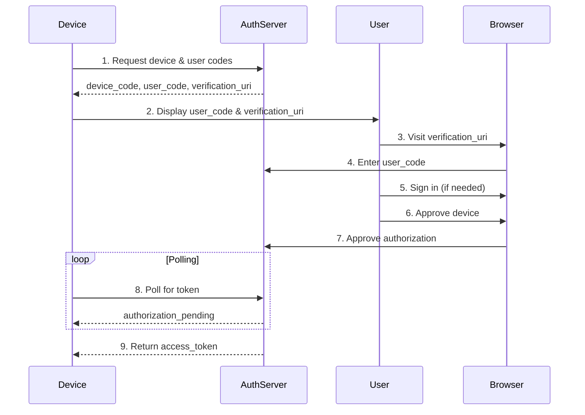

## Overview

The Device Authorization plugin implements the [OAuth 2.0 Device Authorization Grant](https://datatracker.ietf.org/doc/html/rfc8628) (RFC 8628), enabling authentication on devices with limited input capabilities, such as smart TVs, gaming consoles, IoT devices, and CLI applications.

## Use Cases

- **Smart TVs and streaming devices**: Authenticate users on TV apps
- **Gaming consoles**: Sign in on Xbox, PlayStation, etc.
- **IoT devices**: Authenticate smart home devices
- **CLI tools**: Command-line applications and scripts
- **Kiosk applications**: Public terminals and displays

## Installation

```bash
npm install better-auth
```

## Configuration

### Server Setup

From `packages/better-auth/src/plugins/device-authorization/index.ts:120`:

```typescript
import { betterAuth } from "better-auth"
import { deviceAuthorization } from "better-auth/plugins"

const auth = betterAuth({
  plugins: [
    deviceAuthorization({
      // Time until device code expires
      expiresIn: "30m",  // Default: "30m"
      
      // Minimum time between polling attempts
      interval: "5s",  // Default: "5s"
      
      // Length of device code
      deviceCodeLength: 40,  // Default: 40
      
      // Length of user-friendly code
      userCodeLength: 8,  // Default: 8
      
      // Custom device code generator
      generateDeviceCode: async () => {
        return customRandomString()
      },
      
      // Custom user code generator
      generateUserCode: async () => {
        return customUserCode()
      },
      
      // Validate client ID
      validateClient: async (clientId: string) => {
        const client = await db.client.findUnique({
          where: { id: clientId }
        })
        return client !== null
      },
      
      // Handle device auth requests
      onDeviceAuthRequest: async (clientId, scope) => {
        await logDeviceAuthAttempt(clientId, scope)
      },
      
      // Custom verification URI
      verificationUri: "/device",  // Default: "/device"
      
      // Custom schema (optional)
      schema: customDeviceSchema
    })
  ]
})
```

**Options:**

From `packages/better-auth/src/plugins/device-authorization/index.ts:33`:

- `expiresIn` (TimeString): Expiration time for device codes (e.g., "30m", "1h")
- `interval` (TimeString): Minimum polling interval (e.g., "5s")
- `deviceCodeLength` (number): Length of the device verification code
- `userCodeLength` (number): Length of the user-facing code
- `generateDeviceCode` (function): Custom device code generator
- `generateUserCode` (function): Custom user code generator
- `validateClient` (function): Validate client ID before issuing codes
- `onDeviceAuthRequest` (function): Hook for device auth request events
- `verificationUri` (string): URI where users verify their code
- `schema`: Custom database schema

### Client Setup

From `packages/better-auth/src/plugins/device-authorization/client.ts:4`:

```typescript
import { createAuthClient } from "better-auth/client"
import { deviceAuthorizationClient } from "better-auth/client/plugins"

const authClient = createAuthClient({
  plugins: [deviceAuthorizationClient()]
})
```

### Database Schema

From `packages/better-auth/src/plugins/device-authorization/schema.ts:4`:

The plugin adds a `deviceCode` table:

```typescript
{
  deviceCode: {
    fields: {
      deviceCode: { type: "string", required: true },
      userCode: { type: "string", required: true },
      userId: { type: "string", required: false },
      expiresAt: { type: "date", required: true },
      status: { type: "string", required: true },  // "pending" | "approved" | "denied"
      lastPolledAt: { type: "date", required: false },
      pollingInterval: { type: "number", required: false },
      clientId: { type: "string", required: false },
      scope: { type: "string", required: false }
    }
  }
}
```

## Device Authorization Flow

### Flow Diagram



### Step-by-Step Flow

1. **Device requests codes**: Device calls `/device/code` endpoint
2. **Display user code**: Device shows user code and verification URL
3. **User visits URL**: User opens verification URL on another device
4. **Enter code**: User enters the displayed code
5. **Authenticate**: User signs in (if not already authenticated)
6. **Authorize**: User approves the device authorization
7. **Poll for token**: Device polls `/device/token` endpoint
8. **Receive token**: Once approved, device receives access token

## API Methods

### 1. Request Device Code

Initiate the device authorization flow.

**Endpoint:** `POST /device/code`

From `packages/better-auth/src/plugins/device-authorization/routes.ts:49`:

```typescript
// Device client
const response = await authClient.device.code({
  client_id: "your-client-id",
  scope: "read write"  // Optional
})

// Server
const response = await auth.api.deviceCode({
  body: {
    client_id: "your-client-id",
    scope: "read write"
  }
})
```

**Request Body:**

- `client_id` (string, required): The client ID of the application
- `scope` (string, optional): Space-separated list of scopes

**Response:**

```typescript
{
  device_code: string           // Device verification code
  user_code: string             // User-friendly code to display
  verification_uri: string      // URL where user verifies
  verification_uri_complete: string  // URL with pre-filled code
  expires_in: number           // Lifetime in seconds
  interval: number             // Minimum polling interval in seconds
}
```

### 2. Verify User Code

Check the status of a user code.

**Endpoint:** `GET /device?user_code={code}`

From `packages/better-auth/src/plugins/device-authorization/routes.ts:480`:

```typescript
const status = await authClient.device.verify({
  user_code: "ABCD-EFGH"
})
```

**Query Parameters:**

- `user_code` (string, required): The user code to verify

**Response:**

```typescript
{
  user_code: string
  status: "pending" | "approved" | "denied"
}
```

### 3. Approve Device

Approve a device authorization request.

**Endpoint:** `POST /device/approve`

From `packages/better-auth/src/plugins/device-authorization/routes.ts:561`:

```typescript
// Must be authenticated
const result = await authClient.device.approve({
  userCode: "ABCDEFGH"
})
```

**Request Body:**

- `userCode` (string, required): The user code to approve

**Response:**

```typescript
{
  success: boolean
}
```

### 4. Deny Device

Deny a device authorization request.

**Endpoint:** `POST /device/deny`

From `packages/better-auth/src/plugins/device-authorization/routes.ts:688`:

```typescript
// Must be authenticated
const result = await authClient.device.deny({
  userCode: "ABCDEFGH"
})
```

**Request Body:**

- `userCode` (string, required): The user code to deny

**Response:**

```typescript
{
  success: boolean
}
```

### 5. Poll for Token

Exchange device code for access token.

**Endpoint:** `POST /device/token`

From `packages/better-auth/src/plugins/device-authorization/routes.ts:213`:

```typescript
const token = await authClient.device.token({
  grant_type: "urn:ietf:params:oauth:grant-type:device_code",
  device_code: response.device_code,
  client_id: "your-client-id"
})
```

**Request Body:**

- `grant_type` (string, required): Must be `"urn:ietf:params:oauth:grant-type:device_code"`
- `device_code` (string, required): The device verification code
- `client_id` (string, required): The client ID

**Response (Success):**

```typescript
{
  access_token: string
  token_type: "Bearer"
  expires_in: number
  scope: string
}
```

**Response (Pending/Error):**

```typescript
{
  error: "authorization_pending" | "slow_down" | "expired_token" | "access_denied"
  error_description: string
}
```

## Usage Examples

### CLI Application

```typescript
import { authClient } from "./auth-client"

async function signInCLI() {
  console.log("Signing in...")
  
  // 1. Request device code
  const deviceAuth = await authClient.device.code({
    client_id: "cli-app"
  })
  
  // 2. Display instructions to user
  console.log("\nTo sign in:")
  console.log(`1. Visit: ${deviceAuth.verification_uri}`)
  console.log(`2. Enter code: ${deviceAuth.user_code}\n`)
  console.log(`Code expires in ${deviceAuth.expires_in} seconds\n`)
  
  // 3. Poll for authorization
  const pollInterval = deviceAuth.interval * 1000
  const maxAttempts = Math.floor(deviceAuth.expires_in / deviceAuth.interval)
  
  for (let i = 0; i < maxAttempts; i++) {
    await new Promise(resolve => setTimeout(resolve, pollInterval))
    
    try {
      const token = await authClient.device.token({
        grant_type: "urn:ietf:params:oauth:grant-type:device_code",
        device_code: deviceAuth.device_code,
        client_id: "cli-app"
      })
      
      console.log("✓ Successfully signed in!")
      console.log(`Access token: ${token.access_token}`)
      return token
    } catch (error) {
      if (error.error === "authorization_pending") {
        process.stdout.write(".")
        continue
      } else if (error.error === "slow_down") {
        console.log("\nSlowing down polling...")
        await new Promise(resolve => setTimeout(resolve, 5000))
      } else {
        throw error
      }
    }
  }
  
  throw new Error("Authorization timed out")
}
```

### Smart TV Application

```typescript
import { authClient } from "./auth-client"

class TVAuthenticator {
  private deviceCode: string | null = null
  private pollingTimer: NodeJS.Timer | null = null
  
  async startAuth() {
    const response = await authClient.device.code({
      client_id: "smart-tv-app",
      scope: "watch:content"
    })
    
    this.deviceCode = response.device_code
    
    // Show QR code with verification_uri_complete
    this.displayQRCode(response.verification_uri_complete)
    
    // Also show text code
    this.displayUserCode(response.user_code)
    
    // Start polling
    this.startPolling(response.device_code, response.interval)
    
    // Set expiration timer
    setTimeout(() => {
      this.handleExpiration()
    }, response.expires_in * 1000)
  }
  
  private startPolling(deviceCode: string, interval: number) {
    this.pollingTimer = setInterval(async () => {
      try {
        const token = await authClient.device.token({
          grant_type: "urn:ietf:params:oauth:grant-type:device_code",
          device_code: deviceCode,
          client_id: "smart-tv-app"
        })
        
        this.handleSuccess(token)
      } catch (error) {
        if (error.error === "slow_down") {
          // Increase polling interval
          clearInterval(this.pollingTimer!)
          this.startPolling(deviceCode, interval + 5)
        } else if (error.error !== "authorization_pending") {
          this.handleError(error)
        }
      }
    }, interval * 1000)
  }
  
  private displayQRCode(url: string) {
    // Generate and display QR code
    const qr = generateQR(url)
    showOnScreen(qr)
  }
  
  private displayUserCode(code: string) {
    // Format code as XXXX-XXXX for readability
    const formatted = code.match(/.{1,4}/g)?.join("-") || code
    showOnScreen(`Enter code: ${formatted}`)
  }
  
  private handleSuccess(token: any) {
    clearInterval(this.pollingTimer!)
    // Store token and proceed
    localStorage.setItem("access_token", token.access_token)
    navigateToHome()
  }
  
  private handleError(error: any) {
    clearInterval(this.pollingTimer!)
    showError(error.error_description)
  }
  
  private handleExpiration() {
    clearInterval(this.pollingTimer!)
    showError("Authorization code expired. Please try again.")
  }
}
```

### Verification Page (Web)

```tsx
import { useState } from "react"
import { authClient } from "./auth-client"
import { useRouter } from "next/router"

export function DeviceVerificationPage() {
  const router = useRouter()
  const [userCode, setUserCode] = useState(router.query.user_code || "")
  const [status, setStatus] = useState<"pending" | "approved" | "denied" | null>(null)
  const [error, setError] = useState("")
  
  async function handleVerify() {
    try {
      // Verify the code exists
      const result = await authClient.device.verify({
        user_code: userCode
      })
      
      setStatus(result.status)
      
      if (result.status === "pending") {
        // Show approval UI
        setError("")
      } else {
        setError(`This code has already been ${result.status}`)
      }
    } catch (err) {
      setError("Invalid code. Please check and try again.")
    }
  }
  
  async function handleApprove() {
    try {
      await authClient.device.approve({
        userCode: userCode.replace(/-/g, "")
      })
      setStatus("approved")
    } catch (err) {
      setError("Failed to approve device. Please try again.")
    }
  }
  
  async function handleDeny() {
    try {
      await authClient.device.deny({
        userCode: userCode.replace(/-/g, "")
      })
      setStatus("denied")
    } catch (err) {
      setError("Failed to deny device.")
    }
  }
  
  if (status === "approved") {
    return (
      <div className="success">
        <h2>✓ Device Approved</h2>
        <p>You can now return to your device.</p>
      </div>
    )
  }
  
  if (status === "denied") {
    return (
      <div className="error">
        <h2>✗ Device Denied</h2>
        <p>The authorization request was denied.</p>
      </div>
    )
  }
  
  return (
    <div className="verification-page">
      <h1>Device Authorization</h1>
      
      <div className="code-input">
        <label>Enter the code shown on your device:</label>
        <input
          type="text"
          value={userCode}
          onChange={(e) => setUserCode(e.target.value.toUpperCase())}
          placeholder="XXXX-XXXX"
          maxLength={9}
        />
        <button onClick={handleVerify}>Verify</button>
      </div>
      
      {error && <p className="error">{error}</p>}
      
      {status === "pending" && (
        <div className="approval">
          <h2>Approve Device Access?</h2>
          <p>A device is requesting access to your account.</p>
          <div className="actions">
            <button onClick={handleApprove}>Approve</button>
            <button onClick={handleDeny}>Deny</button>
          </div>
        </div>
      )}
    </div>
  )
}
```

## Error Handling

From `packages/better-auth/src/plugins/device-authorization/routes.ts:196`:

### Token Endpoint Errors

- `authorization_pending`: User hasn't approved yet (keep polling)
- `slow_down`: Polling too fast, increase interval by 5 seconds
- `expired_token`: Device code expired, start over
- `access_denied`: User denied the authorization
- `invalid_grant`: Invalid device code or client ID
- `invalid_request`: Malformed request

### Code Generation

From `packages/better-auth/src/plugins/device-authorization/routes.ts:849`:

Default user codes use characters: `ABCDEFGHJKLMNPQRSTUVWXYZ23456789`
(Excludes similar-looking characters: I, O, 0, 1)

## Security Considerations

<Warning>
**Rate Limiting**: The plugin enforces minimum polling intervals to prevent abuse. Devices that poll too frequently will receive `slow_down` errors.
</Warning>

<Info>
**Code Expiration**: Device codes expire after the configured time (default 30 minutes). Expired codes are automatically cleaned up.
</Info>

### Best Practices

1. **Validate clients**: Always use `validateClient` to ensure only authorized apps can request codes
2. **Short-lived codes**: Keep expiration times reasonable (15-30 minutes)
3. **User confirmation**: Clearly show device information before approval
4. **Scope limitations**: Request minimal scopes necessary
5. **Audit logging**: Use `onDeviceAuthRequest` to log authorization attempts

## Related

- [OAuth 2.0 Device Authorization Grant (RFC 8628)](https://datatracker.ietf.org/doc/html/rfc8628)
- [Sessions Concept](/concepts/sessions)
- [API Key Plugin](/plugins/api-key)
