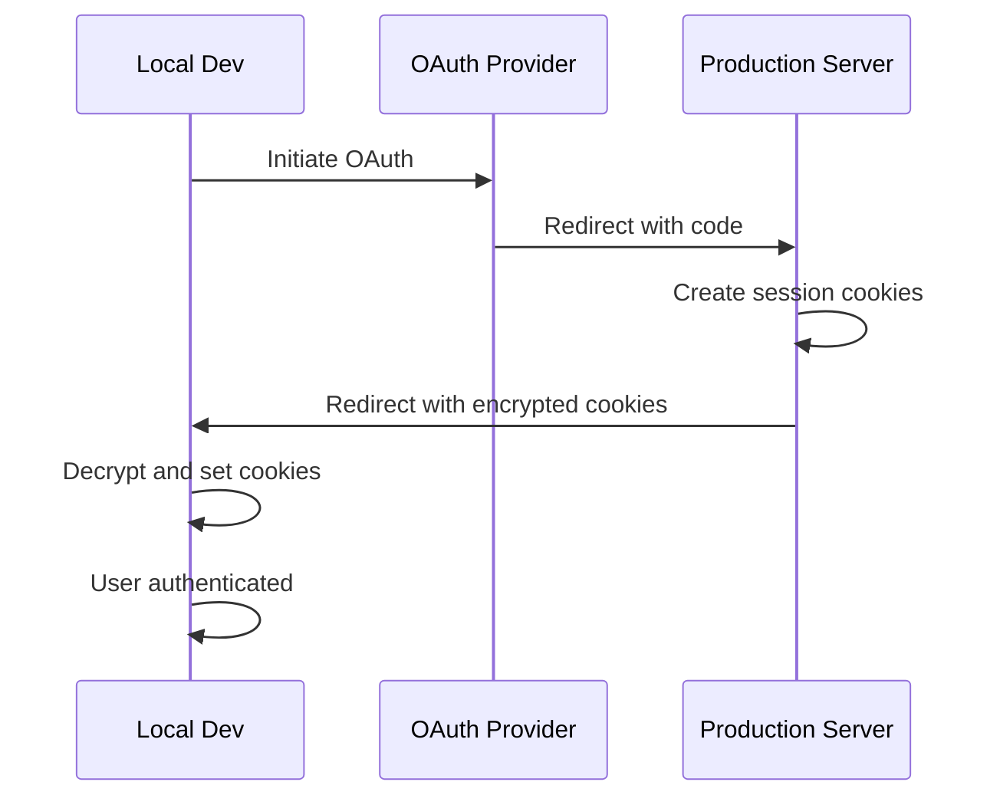

The OAuth Proxy plugin enables seamless local development with OAuth providers by proxying callbacks through your production server. This eliminates the need to register multiple redirect URIs for each developer and testing environment.

## Use Cases

- Local development with OAuth providers
- Preview deployments and staging environments
- Testing OAuth flows without updating provider configurations
- Multi-developer teams working on OAuth integrations
- Serverless and edge environments with dynamic URLs

## How It Works

1. Developer initiates OAuth flow from local environment (e.g., `http://localhost:3000`)
2. OAuth provider redirects to production callback URL (e.g., `https://app.com/api/auth/callback/github`)
3. Production server receives the callback and encrypts the session cookies
4. Production redirects to local environment with encrypted cookies
5. Local environment decrypts cookies and establishes the session



## Installation

The OAuth Proxy plugin is included in the Better Auth core package.

```bash
pnpm add better-auth
```

## Configuration

### Basic Setup

Add the plugin to your Better Auth configuration:

```ts title="auth.ts"
import { betterAuth } from "better-auth";
import { oAuthProxy } from "better-auth/plugins";

export const auth = betterAuth({
  plugins: [
    oAuthProxy({
      // Optional: specify production URL explicitly
      productionURL: process.env.BETTER_AUTH_URL,
    }),
  ],
  socialProviders: {
    github: {
      clientId: process.env.GITHUB_CLIENT_ID!,
      clientSecret: process.env.GITHUB_CLIENT_SECRET!,
    },
  },
});
```

### Environment Variables

```bash title=".env"
# Production URL (used as fallback)
BETTER_AUTH_URL=https://your-app.com

# GitHub OAuth credentials
GITHUB_CLIENT_ID=your_client_id
GITHUB_CLIENT_SECRET=your_client_secret
```

## Configuration Options

<Properties>
  <Property name="currentURL" type="string">
    The current URL of the application. The plugin attempts to infer this from your environment automatically by checking:
    - Base URL from popular hosting providers
    - Request URL if invoked by a client
    - `baseURL` from auth config as fallback
    
    Provide this option if automatic detection doesn't work for your setup.
  </Property>
  <Property name="productionURL" type="string">
    The production URL where OAuth callbacks should be sent. Defaults to `BETTER_AUTH_URL` environment variable. If a request comes from this URL, it won't be proxied.
  </Property>
  <Property name="maxAge" type="number" default="60">
    Maximum age in seconds for encrypted cookie payloads. Payloads older than this will be rejected to prevent replay attacks.
    
    Keep this value short (30-60 seconds) to minimize security risks while allowing normal OAuth flows to complete.
  </Property>
</Properties>

## Setup Steps

### 1. Configure OAuth Provider

In your OAuth provider settings (e.g., GitHub, Google), set the callback URL to your **production URL only**:

```
https://your-app.com/api/auth/callback/github
```

You do **not** need to add local or preview URLs.

### 2. Add Plugin to Auth Config

```ts title="auth.ts"
import { betterAuth } from "better-auth";
import { oAuthProxy } from "better-auth/plugins";

export const auth = betterAuth({
  baseURL: process.env.BETTER_AUTH_URL || "http://localhost:3000",
  plugins: [oAuthProxy()],
  socialProviders: {
    github: {
      clientId: process.env.GITHUB_CLIENT_ID!,
      clientSecret: process.env.GITHUB_CLIENT_SECRET!,
    },
  },
});
```

### 3. Set Environment Variables

```bash title=".env.local"
# Local development
BETTER_AUTH_URL=http://localhost:3000

# OAuth credentials (same as production)
GITHUB_CLIENT_ID=your_client_id
GITHUB_CLIENT_SECRET=your_client_secret
```

```bash title=".env.production"
# Production
BETTER_AUTH_URL=https://your-app.com

# OAuth credentials
GITHUB_CLIENT_ID=your_client_id
GITHUB_CLIENT_SECRET=your_client_secret
```

### 4. Test Locally

Start your local development server and test OAuth sign-in. The flow should work seamlessly:

```bash
pnpm dev
# Navigate to http://localhost:3000 and test OAuth sign-in
```

## Advanced Usage

### Multiple Environments

The proxy works automatically for:
- Local development (`http://localhost:*`)
- Preview deployments (Vercel, Netlify, etc.)
- Staging environments

No additional configuration needed - just ensure `BETTER_AUTH_URL` is set correctly for each environment.

### Custom Current URL Detection

If automatic detection doesn't work:

```ts
oAuthProxy({
  currentURL: process.env.NEXT_PUBLIC_URL || "http://localhost:3000",
  productionURL: "https://your-app.com",
})
```

### Adjust Replay Protection Window

For slower networks or longer OAuth flows:

```ts
oAuthProxy({
  maxAge: 120, // Allow up to 2 minutes for the flow
})
```

For stricter security:

```ts
oAuthProxy({
  maxAge: 30, // Only allow 30 seconds
})
```

## Security Considerations

### Encrypted Cookie Transport

The plugin uses AES-256 encryption (via `symmetricEncrypt`) to protect session cookies during transport:

```ts
// From oauth-proxy/index.ts:559
const payload: EncryptedCookiesPayload = {
  cookies: setCookies,
  timestamp: Date.now(),
};

const encryptedCookies = await symmetricEncrypt({
  key: ctx.context.secret,
  data: JSON.stringify(payload),
});
```

### Replay Attack Prevention

Each encrypted payload includes a timestamp that is validated:

```ts
const now = Date.now();
const age = (now - payload.timestamp) / 1000;

// Allow up to 10 seconds of future skew for clock differences
if (age > maxAge || age < -10) {
  // Reject expired or invalid payload
}
```

**Best Practices:**
- Keep `maxAge` short (default: 60 seconds)
- Use HTTPS in production (automatic with most hosting providers)
- Rotate your `SECRET` environment variable regularly

### Origin Validation

The plugin includes automatic origin checking via the `originCheck` middleware:

```ts title="oauth-proxy/index.ts:71"
use: [originCheck((ctx) => ctx.query.callbackURL)]
```

### Stateless Flow

The proxy works in both stateless (cookie) and stateful (database) modes:

- **Cookie mode** (default): State stored in encrypted cookies
- **Database mode**: State stored in verification table

Both modes support the proxy seamlessly.

## Implementation Details

### Hook Flow

The plugin uses lifecycle hooks to intercept and modify OAuth flows:

#### Before Hooks

1. **Sign-in interception** (`/sign-in/social`, `/sign-in/oauth2`)
   - Checks if proxy is needed
   - Overrides `baseURL` to point to production
   - Constructs proxy callback URL with encrypted state

2. **Callback interception** (`/callback`, `/oauth2/callback`)
   - Decrypts state package
   - Injects state cookie into verification system
   - Temporarily switches to database mode for verification

#### After Hooks

1. **Stateless state packaging**
   - Extracts state cookie from response
   - Encrypts state package with original state
   - Updates authorization URL with encrypted state

2. **Cookie forwarding**
   - Encrypts session cookies from production
   - Appends to redirect URL as query parameter
   - Decrypts and sets cookies in local environment

### Skip Proxy Detection

The proxy automatically skips when:

```ts
// From oauth-proxy/utils.ts
export function checkSkipProxy(
  ctx: GenericEndpointContext,
  opts?: OAuthProxyOptions,
): boolean {
  const currentURL = resolveCurrentURL(ctx, opts);
  const productionOrigin = getOrigin(
    opts?.productionURL || ctx.context.options.baseURL || ctx.context.baseURL
  );
  
  // Skip if request is from production
  return currentURL.origin === productionOrigin;
}
```

## Troubleshooting

### Proxy Not Working

**Check environment variables:**

```bash
echo $BETTER_AUTH_URL
# Should output your production URL
```

**Verify plugin is added:**

```ts
plugins: [oAuthProxy()]
```

**Check callback URL in provider:**

Must be set to production URL (e.g., `https://your-app.com/api/auth/callback/github`)

### "Invalid cookies or secret" Error

- Ensure `SECRET` environment variable matches between local and production
- Check `maxAge` isn't too restrictive for your network latency
- Verify HTTPS is enabled in production

### Cookies Not Setting Locally

- Check browser console for cookie errors
- Ensure local URL matches detected `currentURL`
- Try setting `currentURL` explicitly in plugin options

### State Mismatch Errors

- Clear browser cookies and try again
- Check clock synchronization between local and production
- Increase `maxAge` if OAuth flow is slow

## Examples

### Next.js App Router

```ts title="lib/auth.ts"
import { betterAuth } from "better-auth";
import { oAuthProxy } from "better-auth/plugins";

export const auth = betterAuth({
  baseURL: process.env.BETTER_AUTH_URL,
  plugins: [
    oAuthProxy({
      productionURL: process.env.BETTER_AUTH_URL,
    }),
  ],
  socialProviders: {
    github: {
      clientId: process.env.GITHUB_CLIENT_ID!,
      clientSecret: process.env.GITHUB_CLIENT_SECRET!,
    },
    google: {
      clientId: process.env.GOOGLE_CLIENT_ID!,
      clientSecret: process.env.GOOGLE_CLIENT_SECRET!,
    },
  },
});
```

### Vercel Preview Deployments

No additional configuration needed! The plugin automatically detects Vercel preview URLs:

```bash
# .env
BETTER_AUTH_URL=https://your-app.com

# Vercel automatically provides VERCEL_URL
# Plugin uses it for currentURL detection
```

### Custom Hosting Provider

```ts
oAuthProxy({
  currentURL: 
    process.env.APP_URL || 
    process.env.VERCEL_URL ||
    "http://localhost:3000",
  productionURL: "https://your-app.com",
})
```

## API Reference

### Endpoint

#### GET /oauth-proxy-callback

Internal endpoint that receives proxied OAuth callbacks and sets cookies.

**Query Parameters:**
- `callbackURL` (string, required): The URL to redirect to after setting cookies
- `cookies` (string, required): Encrypted cookies payload

**Server:** `auth.api.oAuthProxyCallback`

This endpoint is automatically called by the plugin and should not be invoked directly.

## Related Plugins

- [Generic OAuth](/plugins/generic-oauth) - Add OAuth support for any provider
- [SSO](/plugins/sso) - Enterprise SSO with SAML and OIDC
