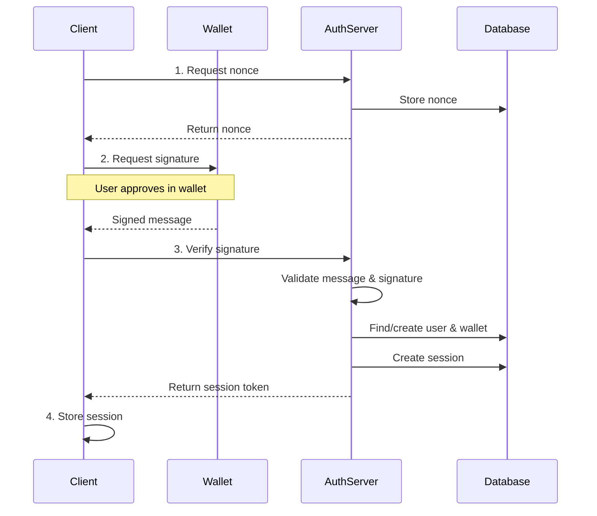

## Overview

The SIWE (Sign-In with Ethereum) plugin implements [EIP-4361](https://eips.ethereum.org/EIPS/eip-4361), enabling users to authenticate using their Ethereum wallets. This provides a decentralized, privacy-preserving authentication method that doesn't require traditional email/password credentials.

## Use Cases

- **Web3 applications**: DApps requiring wallet-based authentication
- **NFT platforms**: Authenticate users to view their NFT collections
- **Decentralized identity**: Self-sovereign identity systems
- **Token-gated content**: Access control based on wallet holdings
- **DAO platforms**: Governance platforms requiring wallet verification
- **Multi-chain support**: Authenticate users across different EVM chains

## Installation

```bash
npm install better-auth siwe
```

## Configuration

### Server Setup

From `packages/better-auth/src/plugins/siwe/index.ts:36`:

```typescript
import { betterAuth } from "better-auth"
import { siwe } from "better-auth/plugins"
import { SiweMessage } from "siwe"
import { generateNonce } from "siwe"

const auth = betterAuth({
  plugins: [
    siwe({
      // Your application domain
      domain: "example.com",
      
      // Email domain for anonymous users (optional)
      emailDomainName: "example.com",  // Default: derived from baseURL
      
      // Allow anonymous users without email
      anonymous: true,  // Default: true
      
      // Generate nonce for signing
      getNonce: async () => {
        return generateNonce()
      },
      
      // Verify the signed message
      verifyMessage: async ({ message, signature, address, chainId }) => {
        try {
          const siweMessage = new SiweMessage(message)
          const result = await siweMessage.verify({ signature })
          return result.success
        } catch (error) {
          console.error("SIWE verification failed:", error)
          return false
        }
      },
      
      // Optional: ENS lookup for username/avatar
      ensLookup: async ({ walletAddress }) => {
        const provider = new ethers.providers.JsonRpcProvider(
          process.env.ETH_RPC_URL
        )
        
        try {
          const name = await provider.lookupAddress(walletAddress)
          const resolver = await provider.getResolver(name)
          const avatar = await resolver?.getAvatar()
          
          return {
            name: name || walletAddress,
            avatar: avatar?.url || ""
          }
        } catch {
          return { name: walletAddress, avatar: "" }
        }
      },
      
      // Custom schema (optional)
      schema: customWalletSchema
    })
  ]
})
```

**Options:**

From `packages/better-auth/src/plugins/siwe/index.ts:18`:

- `domain` (string, required): Your application's domain name
- `emailDomainName` (string, optional): Domain for generating email addresses
- `anonymous` (boolean, optional): Allow users without email (default: true)
- `getNonce` (function, required): Generate cryptographic nonce
- `verifyMessage` (function, required): Verify SIWE signature
- `ensLookup` (function, optional): Resolve ENS names and avatars
- `schema` (object, optional): Custom database schema

### Client Setup

From `packages/better-auth/src/plugins/siwe/client.ts:4`:

```typescript
import { createAuthClient } from "better-auth/client"
import { siweClient } from "better-auth/client/plugins"

const authClient = createAuthClient({
  plugins: [siweClient()]
})
```

### Database Schema

From `packages/better-auth/src/plugins/siwe/types.ts:5`:

The plugin adds a `walletAddress` table:

```typescript
{
  walletAddress: {
    fields: {
      id: { type: "string", required: true },
      userId: { type: "string", required: true },
      address: { type: "string", required: true },      // Checksummed address
      chainId: { type: "number", required: true },
      isPrimary: { type: "boolean", required: true },  // Primary wallet
      createdAt: { type: "date", required: true }
    }
  }
}
```

An `account` record is also created with:
- `providerId`: "siwe"
- `accountId`: `{address}:{chainId}`

## Sign-In Flow

### Flow Diagram



### Step-by-Step Flow

1. **Request nonce**: Client requests a nonce for the wallet address
2. **Sign message**: User signs SIWE message with their wallet
3. **Verify signature**: Server verifies the signature and creates/updates user
4. **Create session**: Server creates session and returns session token

## API Methods

### Get SIWE Nonce

Generate a nonce for signing.

**Endpoint:** `POST /siwe/nonce`

From `packages/better-auth/src/plugins/siwe/index.ts:41`:

```typescript
const response = await authClient.siwe.nonce({
  walletAddress: "0x1234...",
  chainId: 1  // Ethereum mainnet
})

// Returns: { nonce: "random-nonce-string" }
```

**Request Body:**

- `walletAddress` (string, required): Ethereum address (0x...)
- `chainId` (number, optional): Chain ID (default: 1)

**Response:**

```typescript
{
  nonce: string  // Cryptographic nonce for signing
}
```

### Verify SIWE Message

Verify signature and create session.

**Endpoint:** `POST /siwe/verify`

From `packages/better-auth/src/plugins/siwe/index.ts:62`:

```typescript
const session = await authClient.siwe.verify({
  message: "example.com wants you to sign in...",
  signature: "0xabcd...",
  walletAddress: "0x1234...",
  chainId: 1,
  email: "user@example.com"  // Optional, required if anonymous: false
})
```

**Request Body:**

- `message` (string, required): The SIWE message that was signed
- `signature` (string, required): The signature from the wallet
- `walletAddress` (string, required): Ethereum address
- `chainId` (number, optional): Chain ID (default: 1)
- `email` (string, optional): User email (required if `anonymous: false`)

**Response:**

```typescript
{
  token: string
  success: boolean
  user: {
    id: string
    walletAddress: string
    chainId: number
  }
}
```

## Usage Examples

### Basic SIWE Authentication

```typescript
import { authClient } from "./auth-client"
import { SiweMessage } from "siwe"
import { ethers } from "ethers"

async function signInWithWallet() {
  // 1. Connect wallet
  if (!window.ethereum) {
    throw new Error("No wallet found")
  }
  
  const provider = new ethers.providers.Web3Provider(window.ethereum)
  await provider.send("eth_requestAccounts", [])
  const signer = provider.getSigner()
  const address = await signer.getAddress()
  const chainId = await signer.getChainId()
  
  // 2. Get nonce
  const { nonce } = await authClient.siwe.nonce({
    walletAddress: address,
    chainId
  })
  
  // 3. Create SIWE message
  const message = new SiweMessage({
    domain: window.location.host,
    address,
    statement: "Sign in to Example App",
    uri: window.location.origin,
    version: "1",
    chainId,
    nonce
  })
  
  const messageString = message.prepareMessage()
  
  // 4. Sign message
  const signature = await signer.signMessage(messageString)
  
  // 5. Verify and create session
  const session = await authClient.siwe.verify({
    message: messageString,
    signature,
    walletAddress: address,
    chainId
  })
  
  console.log("Signed in!", session.user)
  return session
}
```

### React Component with Wagmi

```tsx
import { useAccount, useSignMessage } from "wagmi"
import { SiweMessage } from "siwe"
import { authClient } from "./auth-client"
import { useState } from "react"

export function WalletAuth() {
  const { address, chainId } = useAccount()
  const { signMessageAsync } = useSignMessage()
  const [loading, setLoading] = useState(false)
  const [error, setError] = useState("")
  
  async function handleSignIn() {
    if (!address || !chainId) return
    
    setLoading(true)
    setError("")
    
    try {
      // Get nonce
      const { nonce } = await authClient.siwe.nonce({
        walletAddress: address,
        chainId
      })
      
      // Create message
      const message = new SiweMessage({
        domain: window.location.host,
        address,
        statement: "Sign in with Ethereum",
        uri: window.location.origin,
        version: "1",
        chainId,
        nonce
      })
      
      const preparedMessage = message.prepareMessage()
      
      // Sign
      const signature = await signMessageAsync({
        message: preparedMessage
      })
      
      // Verify
      const session = await authClient.siwe.verify({
        message: preparedMessage,
        signature,
        walletAddress: address,
        chainId
      })
      
      console.log("Authentication successful", session)
    } catch (err) {
      console.error("Sign-in failed:", err)
      setError(err.message)
    } finally {
      setLoading(false)
    }
  }
  
  if (!address) {
    return <div>Connect your wallet first</div>
  }
  
  return (
    <div>
      <button onClick={handleSignIn} disabled={loading}>
        {loading ? "Signing in..." : "Sign In with Ethereum"}
      </button>
      {error && <p className="error">{error}</p>}
    </div>
  )
}
```

### Multi-Chain Support

From `packages/better-auth/src/plugins/siwe/index.ts:160`:

Users can authenticate with the same address on multiple chains:

```typescript
import { authClient } from "./auth-client"

async function signInMultiChain() {
  // Sign in on Ethereum mainnet
  await signInWithWallet(1)
  
  // Same address, different chain (Polygon)
  await signInWithWallet(137)
  
  // Same address, Arbitrum
  await signInWithWallet(42161)
  
  // All three authentications link to the same user account
}

async function signInWithWallet(chainId: number) {
  const address = await getWalletAddress()
  const { nonce } = await authClient.siwe.nonce({ walletAddress: address, chainId })
  
  const message = createSiweMessage({ address, chainId, nonce })
  const signature = await signMessage(message)
  
  return authClient.siwe.verify({
    message,
    signature,
    walletAddress: address,
    chainId
  })
}
```

### With ENS Resolution

```typescript
import { siwe } from "better-auth/plugins"
import { ethers } from "ethers"

const auth = betterAuth({
  plugins: [
    siwe({
      domain: "example.com",
      getNonce: async () => generateNonce(),
      verifyMessage: async ({ message, signature }) => {
        const siweMessage = new SiweMessage(message)
        const result = await siweMessage.verify({ signature })
        return result.success
      },
      
      // ENS lookup for better UX
      ensLookup: async ({ walletAddress }) => {
        const provider = new ethers.providers.InfuraProvider(
          "mainnet",
          process.env.INFURA_KEY
        )
        
        try {
          // Resolve ENS name
          const ensName = await provider.lookupAddress(walletAddress)
          
          if (ensName) {
            const resolver = await provider.getResolver(ensName)
            const avatar = await resolver?.getAvatar()
            
            return {
              name: ensName,
              avatar: avatar?.url || ""
            }
          }
        } catch (error) {
          console.error("ENS lookup failed:", error)
        }
        
        // Fallback to shortened address
        return {
          name: `${walletAddress.slice(0, 6)}...${walletAddress.slice(-4)}`,
          avatar: ""
        }
      }
    })
  ]
})
```

### Token-Gated Access

```typescript
import { authClient } from "./auth-client"
import { ethers } from "ethers"

async function checkNFTAccess() {
  const session = await authClient.getSession()
  
  if (!session) {
    throw new Error("Not authenticated")
  }
  
  // Get user's wallet addresses from database
  const wallets = await db.walletAddress.findMany({
    where: { userId: session.user.id }
  })
  
  const provider = new ethers.providers.JsonRpcProvider(RPC_URL)
  const nftContract = new ethers.Contract(NFT_ADDRESS, NFT_ABI, provider)
  
  // Check if any of user's wallets own the required NFT
  for (const wallet of wallets) {
    const balance = await nftContract.balanceOf(wallet.address)
    if (balance.gt(0)) {
      return { hasAccess: true, wallet: wallet.address }
    }
  }
  
  return { hasAccess: false }
}
```

## How It Works

### Nonce Generation and Storage

From `packages/better-auth/src/plugins/siwe/index.ts:50`:

```typescript
// Nonce is stored in verification table
await ctx.context.internalAdapter.createVerificationValue({
  identifier: `siwe:${walletAddress}:${chainId}`,
  value: nonce,
  expiresAt: new Date(Date.now() + 15 * 60 * 1000)  // 15 minutes
})
```

### Address Checksumming

From `packages/better-auth/src/plugins/siwe/index.ts:49`:

All wallet addresses are converted to checksum format:

```typescript
const walletAddress = toChecksumAddress(rawWalletAddress)
// 0xabc... → 0xAbC...
```

### User and Wallet Management

From `packages/better-auth/src/plugins/siwe/index.ts:160`:

The plugin handles multiple scenarios:

1. **New user + new wallet**: Creates user and wallet records
2. **Existing user + new chain**: Links new chain to existing user
3. **Same address, different chain**: Associates with same user
4. **Anonymous vs. email users**: Handles both authentication modes

## Security Considerations

<Warning>
**Nonce Expiration**: Nonces expire after 15 minutes. Ensure users sign messages promptly.
</Warning>

<Info>
**Replay Protection**: Each nonce can only be used once and is deleted after verification.
</Info>

### Best Practices

1. **Use HTTPS**: Always use HTTPS in production
2. **Verify domain**: Ensure the domain in SIWE message matches your application
3. **Validate chain ID**: Verify users are on expected chains
4. **ENS resolution**: Use ENS for better user experience
5. **Session management**: Implement proper session refresh/expiration
6. **Multi-wallet support**: Allow users to link multiple wallets
7. **Fallback email**: Consider requiring email for account recovery

## Error Codes

From `packages/better-auth/src/plugins/siwe/index.ts:116`:

- `UNAUTHORIZED_INVALID_OR_EXPIRED_NONCE`: Nonce is invalid or expired
- `UNAUTHORIZED_INVALID_SIWE_SIGNATURE`: Signature verification failed

## Related

- [EIP-4361: Sign-In with Ethereum](https://eips.ethereum.org/EIPS/eip-4361)
- [SIWE Library](https://docs.login.xyz/)
- [Sessions Concept](/concepts/sessions)
- [Custom Session Plugin](/plugins/custom-session)
